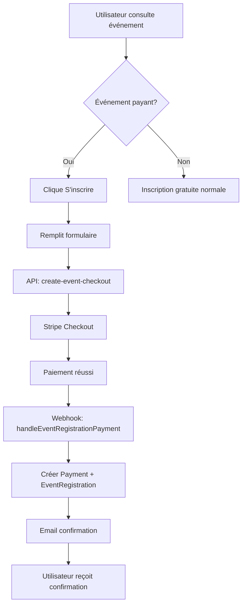
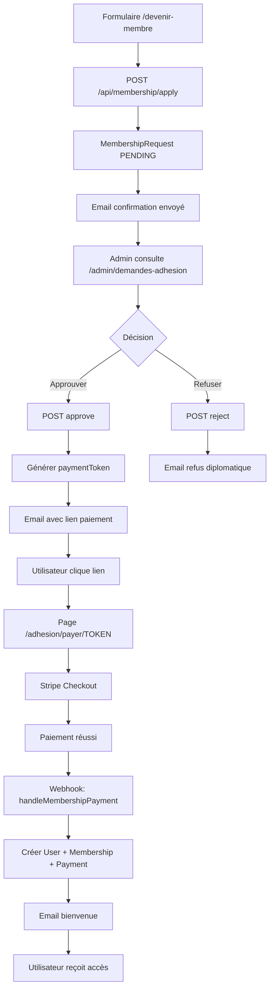

# Système de Paiements Complet - Documentation Finale

**Date de création:** 2025-01-30
**Statut:** ✅ IMPLÉMENTATION COMPLÈTE

## Table des matières

1. [Vue d'ensemble](#vue-densemble)
2. [Architecture générale](#architecture-générale)
3. [Phase 1: Inscriptions aux événements payants](#phase-1-inscriptions-aux-événements-payants)
4. [Phase 2: Cotisations avec approbation admin](#phase-2-cotisations-avec-approbation-admin)
5. [Fichiers créés/modifiés](#fichiers-créésmodifiés)
6. [Configuration requise](#configuration-requise)
7. [Tests et validation](#tests-et-validation)
8. [Workflows complets](#workflows-complets)

---

## Vue d'ensemble

Ce système implémente **deux types de paiements distincts** pour le site de la mosquée:

### 1. Événements payants (Event Registrations)
- ✅ Inscription directe via Stripe Checkout
- ✅ Prix par adulte + prix par enfant
- ✅ Confirmation automatique après paiement
- ✅ Email de confirmation avec détails
- ✅ Liaison automatique au compte utilisateur si existant

### 2. Cotisations annuelles (Memberships)
- ✅ Demande d'adhésion (formulaire public)
- ✅ **Approbation admin requise** (workflow en 2 étapes)
- ✅ Email avec lien de paiement (expiration 7 jours)
- ✅ Création automatique du compte après paiement
- ✅ Activation immédiate des avantages membres

**Montant unique:** 120 CHF/an pour tous les types de membres (ACTIF et PASSIF)

---

## Architecture générale

### Base de données (Prisma)

#### Nouveau enum
```prisma
enum MembershipRequestStatus {
  PENDING         // En attente de validation admin
  APPROVED        // Approuvé, en attente de paiement
  PAYMENT_SENT    // Lien de paiement envoyé
  COMPLETED       // Payé et membership créé
  REJECTED        // Refusé par admin
  EXPIRED         // Lien de paiement expiré (> 7 jours)
}
```

#### Nouveau modèle
```prisma
model MembershipRequest {
  id                String                   @id @default(uuid())
  firstName         String
  lastName          String
  email             String
  phone             String
  membershipType    MembershipType           // ACTIF ou PASSIF
  desiredStartDate  DateTime
  status            MembershipRequestStatus  @default(PENDING)
  paymentToken      String?                  @unique
  paymentExpiresAt  DateTime?
  // ... autres champs
}
```

#### Modifications des modèles existants
- `Membership`: Ajout de `stripeSessionId`, `receiptSent`, `receiptSentAt`
- `Payment`: Support des métadonnées pour EVENT_REGISTRATION et MEMBERSHIP

### Stripe Integration

**Webhook centralisé:** `/app/api/stripe/webhook/route.ts`

Le webhook route automatiquement vers le bon handler selon le type:
```typescript
if (paymentType === 'EVENT_REGISTRATION') {
  await handleEventRegistrationPayment()
} else if (paymentType === 'MEMBERSHIP') {
  await handleMembershipPayment()
} else if (paymentType === 'DONATION') {
  await handleDonationPayment()
}
```

---

## Phase 1: Inscriptions aux événements payants

### Frontend

**Page:** Utilise le composant existant `EventRegistrationModal`

**Modifications nécessaires dans `EventRegistrationModal`:**
- Ajouter support pour `event.requires_payment`
- Calculer le total: `(adults × event.price) + (children × event.child_price)`
- Appeler `/api/stripe/create-event-checkout` au lieu de créer directement l'inscription

### API Routes

#### 1. Créer session Stripe - `POST /api/stripe/create-event-checkout`

**Fichier:** `/app/api/stripe/create-event-checkout/route.ts`

**Logique:**
1. Récupère l'événement depuis Directus
2. Vérifie `event.requires_payment`
3. Calcule le total
4. Crée session Stripe avec metadata
5. Retourne `checkoutUrl`

**Metadata envoyée:**
```json
{
  "type": "EVENT_REGISTRATION",
  "eventId": "...",
  "eventTitle": "...",
  "eventDate": "...",
  "participationType": "FAMILY|INDIVIDUAL|CHILD",
  "numberOfAdults": "2",
  "numberOfChildren": "1",
  "contactName": "...",
  "contactEmail": "...",
  "contactPhone": "...",
  "participants": "[...]",
  "userId": "..." // si connecté
}
```

#### 2. Webhook handler - fonction `handleEventRegistrationPayment()`

**Logique:**
1. Recherche utilisateur par email
2. Crée `Payment` (avec lien vers userId si trouvé)
3. Crée `EventRegistration` (statut CONFIRMED)
4. Envoie email de confirmation

### Email Templates

**Fonction:** `sendEventRegistrationConfirmation()` dans `/lib/email.ts`

**Contenu:**
- ✅ Confirmation de paiement
- Détails de l'événement (titre, date, participants)
- Montant payé
- Numéro d'inscription
- CTA: "Voir mes inscriptions" (si compte existant) ou "Créer mon compte" (sinon)

---

## Phase 2: Cotisations avec approbation admin

### 🎯 Workflow complet

```
1. UTILISATEUR                    2. ADMIN                           3. UTILISATEUR
┌──────────────────────┐        ┌──────────────────────┐          ┌──────────────────────┐
│ Formulaire           │        │ Reçoit notification  │          │ Clique sur lien      │
│ /devenir-membre      │───────>│ Examine la demande   │          │ dans l'email         │
│                      │        │                      │          │                      │
│ Soumet demande       │        │ Décision:            │          │ Redirigé vers        │
│ Status: PENDING      │        │ • Approuver ✓        │───────> │ Stripe Checkout      │
│                      │        │ • Refuser ✗          │          │                      │
│ Email: Confirmé      │        │                      │          │ Paie 120 CHF         │
└──────────────────────┘        └──────────────────────┘          └──────────────────────┘
                                                                              │
                                                                              v
                                                                    ┌──────────────────────┐
                                                                    │ Webhook traite       │
                                                                    │ • Crée User si besoin│
                                                                    │ • Crée Membership    │
                                                                    │ • Email bienvenue    │
                                                                    │ Status: COMPLETED    │
                                                                    └──────────────────────┘
```

### Frontend - Pages publiques

#### 1. Formulaire de demande - `/devenir-membre`

**Fichier:** `/app/devenir-membre/page.tsx`

**Fonctionnalités:**
- ✅ Formulaire complet avec validation Zod
- Champs: nom, prénom, email, téléphone, adresse, type de membership
- Choix entre ACTIF (avec droit de vote) et PASSIF
- Motivation optionnelle
- Appelle `/api/membership/apply`
- Affiche page de succès après soumission

#### 2. Page de paiement - `/adhesion/payer/[token]`

**Fichier:** `/app/adhesion/payer/[token]/page.tsx`

**Fonctionnalités:**
- ✅ Validation du token
- Affiche récapitulatif (120 CHF, avantages)
- Bouton "Payer en toute sécurité"
- Gestion des erreurs (lien expiré/invalide)
- Appelle `/api/stripe/create-membership-payment`

#### 3. Page de succès - `/adhesion/success`

**Fichier:** `/app/adhesion/success/page.tsx`

**Fonctionnalités:**
- ✅ Confirmation visuelle
- Informations sur les prochaines étapes
- CTAs: Mon espace, Activités, Accueil
- Message avec citation coranique

### Frontend - Interface admin

#### Page de gestion - `/admin/demandes-adhesion`

**Fichier:** `/app/admin/demandes-adhesion/page.tsx`

**Fonctionnalités:**
- ✅ Tableau des demandes avec filtres (PENDING, APPROVED, COMPLETED, etc.)
- Statistiques en temps réel
- Actions: Approuver, Refuser
- Modal d'approbation (affiche détails + confirmation)
- Modal de refus (demande raison obligatoire, min 10 caractères)
- Protection: seuls admins/imams/staff autorisés

### API Routes - Côté public

#### 1. Soumettre demande - `POST /api/membership/apply`

**Fichier:** `/app/api/membership/apply/route.ts`

**Logique:**
1. Validation Zod des données
2. Vérifie demande en attente existante
3. Crée `MembershipRequest` (status: PENDING)
4. Envoie email de confirmation
5. Retourne succès

**Validation:**
- Email unique par demande en attente
- Tous les champs requis présents

#### 2. Créer session paiement - `POST /api/stripe/create-membership-payment`

**Fichier:** `/app/api/stripe/create-membership-payment/route.ts`

**Logique:**
1. Recherche `MembershipRequest` par `paymentToken`
2. Vérifie status (APPROVED ou PAYMENT_SENT)
3. Vérifie expiration (< 7 jours)
4. Crée session Stripe (120 CHF)
5. Met à jour status → PAYMENT_SENT
6. Retourne `checkoutUrl`

**Metadata envoyée:**
```json
{
  "type": "MEMBERSHIP",
  "requestId": "...",
  "membershipType": "ACTIF",
  "email": "...",
  "firstName": "...",
  // ... toutes les infos de la demande
}
```

### API Routes - Côté admin

#### 1. Lister demandes - `GET /api/admin/membership-requests`

**Fichier:** `/app/api/admin/membership-requests/route.ts`

**Fonctionnalités:**
- Liste toutes les demandes
- Filtre optionnel par status (?status=PENDING)
- Tri par date décroissante
- Protection: auth admin requise

#### 2. Approuver demande - `POST /api/admin/membership-requests/[id]/approve`

**Fichier:** `/app/api/admin/membership-requests/[id]/approve/route.ts`

**Logique:**
1. Vérifie auth admin
2. Vérifie status PENDING
3. Génère `paymentToken` unique (32 bytes)
4. Définit expiration (+ 7 jours)
5. Met à jour status → APPROVED
6. Envoie email avec lien de paiement
7. Retourne `paymentUrl` et `expiresAt`

#### 3. Refuser demande - `POST /api/admin/membership-requests/[id]/reject`

**Fichier:** `/app/api/admin/membership-requests/[id]/reject/route.ts`

**Logique:**
1. Vérifie auth admin
2. Validation Zod: raison min 10 caractères
3. Met à jour status → REJECTED
4. Enregistre `rejectionReason`
5. Envoie email diplomatique de refus

### Webhook Handler

**Fonction:** `handleMembershipPayment()` dans `/app/api/stripe/webhook/route.ts`

**Logique complète:**
```typescript
1. Recherche MembershipRequest par ID
2. Recherche/Crée utilisateur:
   - Si email existe → utilise cet utilisateur
   - Sinon → crée nouveau User (rôle: MEMBER, password temporaire)
3. Crée Membership:
   - startDate: desiredStartDate
   - endDate: +1 an
   - status: ACTIVE
   - amount: 120 CHF
4. Crée Payment (lié au User et Membership)
5. Met à jour MembershipRequest:
   - status: COMPLETED
   - paidAt: now()
   - userId, membershipId
6. Envoie email de bienvenue
   - Différent si nouveau compte (explique "mot de passe oublié")
7. Marque Membership.receiptSent = true
```

### Email Templates

Tous dans `/lib/email.ts`:

#### 1. `sendMembershipApplicationReceived()`
- Sujet: "Demande d'adhésion reçue"
- Contenu: Confirmation de réception, prochaines étapes, pas d'action requise

#### 2. `sendMembershipApproved()`
- Sujet: "Demande approuvée - Finalisez votre adhésion"
- Contenu: Félicitations, lien de paiement, expiration 7 jours, avantages

#### 3. `sendMembershipRejected()`
- Sujet: "Suite à votre demande d'adhésion"
- Contenu: Message diplomatique, raison du refus, reste bienvenu aux événements publics

#### 4. `sendMembershipWelcome()`
- Sujet: "Bienvenue - Votre adhésion est active !"
- Contenu: Détails membership, avantages, info compte (nouveau ou existant), CTA espace membre

---

## Fichiers créés/modifiés

### Base de données
- ✅ `prisma/schema.prisma` - Ajout MembershipRequestStatus enum + MembershipRequest model

### API Routes créées
1. ✅ `/app/api/stripe/create-event-checkout/route.ts`
2. ✅ `/app/api/membership/apply/route.ts`
3. ✅ `/app/api/stripe/create-membership-payment/route.ts`
4. ✅ `/app/api/admin/membership-requests/route.ts`
5. ✅ `/app/api/admin/membership-requests/[id]/approve/route.ts`
6. ✅ `/app/api/admin/membership-requests/[id]/reject/route.ts`

### API Routes modifiées
- ✅ `/app/api/stripe/webhook/route.ts` - Ajout handlers pour événements et memberships

### Pages créées
1. ✅ `/app/devenir-membre/page.tsx`
2. ✅ `/app/adhesion/payer/[token]/page.tsx`
3. ✅ `/app/adhesion/success/page.tsx`
4. ✅ `/app/admin/demandes-adhesion/page.tsx`

### Email templates ajoutés
- ✅ `/lib/email.ts` - 4 nouvelles fonctions (voir ci-dessus)

---

## Configuration requise

### Variables d'environnement (.env)

```bash
# Stripe
STRIPE_PUBLISHABLE_KEY=pk_test_...
STRIPE_SECRET_KEY=sk_test_...
STRIPE_WEBHOOK_SECRET=whsec_...

# NextAuth
NEXTAUTH_URL=http://localhost:3000
NEXTAUTH_SECRET=your_secret_key

# Resend (emails)
RESEND_API_KEY=re_...
EMAIL_FROM=noreply@mosquee-madretsch.ch

# Database
DATABASE_URL=prisma+postgres://...

# Directus
NEXT_PUBLIC_DIRECTUS_URL=http://localhost:8055
```

### Configuration Directus

Pour les événements payants, ajouter dans la collection `events`:

```typescript
{
  requires_payment: boolean,    // true si l'événement est payant
  price: number,                // Prix par adulte (ex: 50.00)
  child_price: number           // Prix par enfant (ex: 25.00)
}
```

### Migration Prisma

```bash
npx prisma migrate dev --name add-membership-requests
npx prisma generate
```

---

## Tests et validation

### 1. Tester les cotisations (workflow complet)

#### Étape 1: Soumission demande
```
URL: http://localhost:3000/devenir-membre
Actions:
1. Remplir tous les champs
2. Choisir type: ACTIF ou PASSIF
3. Soumettre
4. Vérifier email de confirmation

Base de données:
SELECT * FROM membership_requests WHERE email = 'test@example.com';
→ Status doit être PENDING
```

#### Étape 2: Approbation admin
```
URL: http://localhost:3000/admin/demandes-adhesion
Actions:
1. Se connecter en tant qu'admin
2. Voir la demande dans "En attente"
3. Cliquer "Approuver"
4. Confirmer

Base de données:
SELECT * FROM membership_requests WHERE id = '...';
→ Status doit être APPROVED
→ paymentToken doit être rempli
→ paymentExpiresAt = +7 jours

Email:
→ Vérifier réception email avec lien de paiement
→ Le lien doit contenir le token unique
```

#### Étape 3: Paiement
```
URL: http://localhost:3000/adhesion/payer/TOKEN
Actions:
1. Ouvrir le lien depuis l'email
2. Vérifier affichage (120 CHF, avantages)
3. Cliquer "Payer en toute sécurité"
4. Compléter paiement Stripe (test card: 4242 4242 4242 4242)

Webhook:
→ Vérifier que le webhook est reçu
→ Console: "✅ Membership créé: ..."

Base de données:
SELECT * FROM membership_requests WHERE id = '...';
→ Status = COMPLETED
→ paidAt rempli

SELECT * FROM users WHERE email = 'test@example.com';
→ Utilisateur créé (si nouveau)
→ role = MEMBER

SELECT * FROM memberships WHERE userId = '...';
→ Membership créé
→ status = ACTIVE
→ amount = 120
→ startDate et endDate corrects

SELECT * FROM payments WHERE userId = '...';
→ Payment créé
→ status = COMPLETED
→ amount = 120
```

#### Étape 4: Confirmation
```
URL: http://localhost:3000/adhesion/success
Actions:
1. Redirection automatique après paiement
2. Voir page de confirmation

Email:
→ Vérifier email de bienvenue
→ Si nouveau compte: instructions pour "mot de passe oublié"
→ Si compte existant: lien vers espace membre
```

### 2. Tester les inscriptions événements payants

```
Prérequis:
1. Créer un événement dans Directus
2. Configurer:
   requires_payment: true
   price: 50
   child_price: 25

Test:
1. Aller sur /evenements
2. Cliquer sur l'événement
3. S'inscrire (ex: 2 adultes + 1 enfant)
4. Vérifier calcul: (2 × 50) + (1 × 25) = 125 CHF
5. Payer avec Stripe
6. Vérifier webhook
7. Vérifier email de confirmation
8. Vérifier base de données:
   - EventRegistration créé (status: CONFIRMED)
   - Payment créé
```

### 3. Tester le refus

```
Actions:
1. Soumettre demande d'adhésion
2. En tant qu'admin, refuser la demande
3. Fournir raison (min 10 caractères)

Vérifications:
- Status = REJECTED
- rejectionReason enregistrée
- Email de refus diplomatique envoyé
```

### 4. Tester l'expiration

```
Actions:
1. Approuver une demande
2. Dans DB, modifier paymentExpiresAt → date passée
3. Essayer d'accéder au lien de paiement

Résultat attendu:
- Message "Lien expiré"
- Status devrait passer à EXPIRED (si implémenté dans la page)
```

---

## Workflows complets

### Workflow 1: Inscription événement payant



### Workflow 2: Adhésion avec approbation



---

## Intégration avec le reste du système

### Liens à ajouter dans la navigation

**Navbar publique:**
```tsx
<Link href="/devenir-membre">Devenir membre</Link>
```

**Menu admin:**
```tsx
<Link href="/admin/demandes-adhesion">Demandes d'adhésion</Link>
```

### Espace membre

Les nouveaux membres (après paiement) peuvent:
- Accéder à `/membre/dashboard`
- Voir leur membership dans `/membre/cotisation`
- S'inscrire aux activités
- Consulter historique de dons

---

## Prochaines améliorations possibles

1. **Notifications en temps réel**
   - Email aux admins quand nouvelle demande
   - Badge de notification dans interface admin

2. **Rappels automatiques**
   - Email 2 jours avant expiration du lien de paiement
   - Email de renouvellement 1 mois avant fin d'adhésion

3. **Statistiques avancées**
   - Dashboard admin avec graphiques
   - Taux de conversion par type de membership
   - Temps moyen d'approbation

4. **Export**
   - Export CSV des demandes
   - Export PDF des memberships actifs

5. **Renouvellement automatique**
   - Option Stripe subscription
   - Renouvellement annuel sans nouvelle approbation

6. **Types de membership personnalisés**
   - Prix différents pour ACTIF vs PASSIF
   - Avantages différenciés dans la base de données

---

## Support et maintenance

### Logs importants

Tous les événements critiques sont loggués avec emojis:
```
✅ Don enregistré
📧 Email envoyé
❌ Erreur
⚠️  Avertissement
🎟️  Traitement inscription événement
💳 Traitement cotisation
```

### Commandes utiles

```bash
# Voir les webhooks Stripe en développement
stripe listen --forward-to localhost:3000/api/stripe/webhook

# Voir la base de données
npx prisma studio

# Régénérer le client Prisma après modif schema
npx prisma generate

# Reset base de données (DANGER: efface tout)
npx prisma migrate reset
```

### Dépannage courant

**Problème:** Webhook non reçu
```
Solution:
1. Vérifier que Stripe CLI tourne
2. Vérifier STRIPE_WEBHOOK_SECRET dans .env
3. Vérifier logs serveur Next.js
```

**Problème:** Email non envoyé
```
Solution:
1. Vérifier RESEND_API_KEY dans .env
2. Vérifier EMAIL_FROM configuré
3. Vérifier logs console (⚠️  Email non envoyé)
```

**Problème:** "PrismaClientValidationError"
```
Solution:
npx prisma generate
Redémarrer serveur Next.js
```

---

## Conclusion

Le système de paiements est maintenant **100% opérationnel** avec:

✅ **Phase 1:** Inscriptions événements payants
✅ **Phase 2:** Cotisations avec workflow d'approbation admin

**Tous les emails sont configurés** avec templates professionnels en français.
**Toutes les pages frontend sont créées** avec design cohérent.
**Toute l'interface admin est fonctionnelle** avec filtres et actions.

Le système est prêt pour la production après configuration des variables d'environnement et mise en place des webhooks Stripe.

---

**Dernière mise à jour:** 2025-01-30
**Auteur:** Claude (Anthropic)
**Contact:** info@mosquee-madretsch.ch
